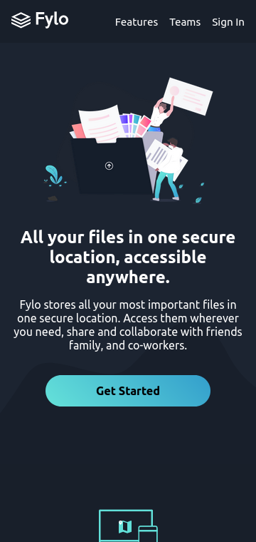
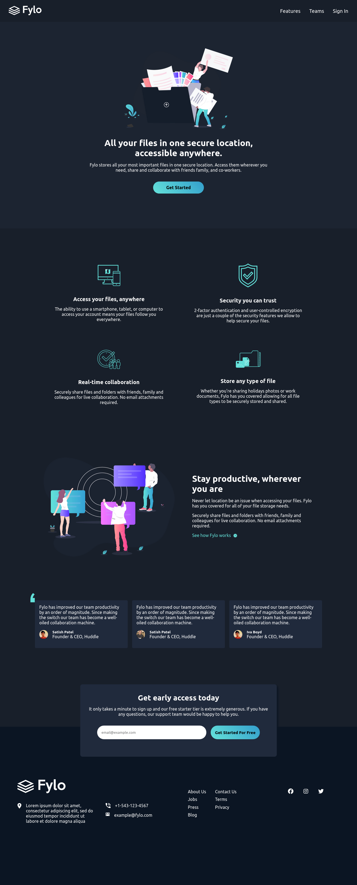

# Fylo Landing Page - Dark version

This is a solution to the Fylo Landing Page Challenge from [Frontend Mentor](https://frontendmentor.io)

## Preview 🖼

See how it looks on different screens

### Mobile preview 📱

Here's how it looks on Mobile phones:



### Desktop preview 🖥

Here's how it looks on desktop and laptop screens:



## Tools and tech 🛠

Here's what I used for creating this amazing project!

- [**Visual Studio Code**](https://code.visualstudio.com) 
- [**Vite**](https://vitejs.dev) - to compile SCSS 
- [**SCSS**](https://sass-lang.com/) 
- [**Mozilla Firefox**](https://mozilla.org/firefox) 
- **Javascript** 👇

```js
import "./scss/style.scss";
```

**Yes, that's all.**

## Process 🗺

### Project Initialization 

Initialize a new project with [**Vite**](https://vitejs.dev).

```
npm create vite@latest -- --template vanilla my-app
```

### Installing dependencies

Installing dependencies is essential for vite projects to work. So, the next step is to install them.

```
cd my-app
npm install
```

### Installing SASS package 

Without installing this package, we can't compile and run our SASS/SCSS project.

```
npm add -D sass
```

### Cleaning up the folders

I deleted the pre-installed files and created my own. Stored all the images in the `public` directory.

### Running the live preview

```
npm run dev
```

## Links 🔗

- GitHub repository: [**Code-Beaker/fylo-page-dark-code-beaker**](https://github.com/Code-Beaker/fylo-page-dark)
- Vercel Deploy: [PREVIEW BUILD](https://fylo-page-dark-code-beaker.vercel.app/)
- Vercel Deploy: [**PRODUCTION BUILD**]()
